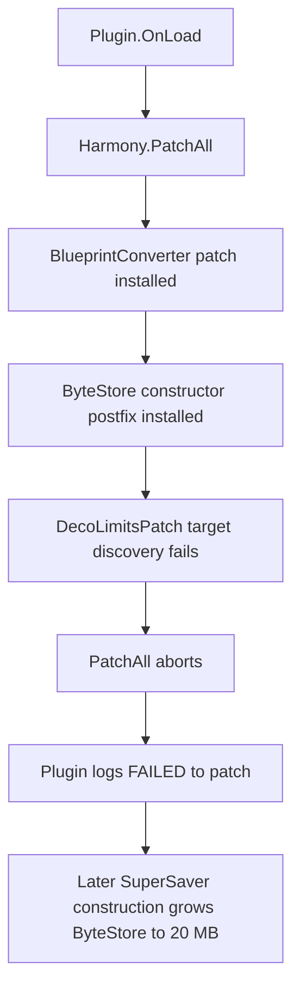

# Deco Limit Lifter: Technical Analysis Log

Audit date: 2026-06-27  
Repository revision: `eb4155dd03b230b6d09c0471f853c592a9c77cc4` (`main`)  
Audited version: `1.0.0`; remediated version: `1.1.0`  
Manifest game version: `4.2.9.3`  
Harmony version: `2.3.5`  
Target framework: `.NET Framework 4.7.2`

## Purpose and scope

This document records how the mod is designed, how From The Depths actually serializes the affected data, what version 1.0 did at runtime, and how version 1.1 remediates the verified failures.

The analysis covered:

- every C# file in `DecoLimitless/Source`;
- the shipped `DecoLimitless/DecoLimitLifter.dll`;
- a fresh Release build from the checked-in source;
- the installed `DataManagement.dll`, `Core.dll`, `Common.dll`, and `FtD.dll` game assemblies;
- Harmony target discovery and patch installation in an isolated process;
- synthetic legacy and sentinel round trips;
- forced header/data buffer growth; and
- the sentinel `ConvertToReader` boundary.

The game-side types inspected were `SuperBase`, `SuperSaver`, `SuperLoader`, `ByteStore`, `SuperSaverReusableByteArray`, `PackageManager<T>`, `DataPackage`, `AllConstructDecorations`, `DecorationManager`, `CSave`, `BlueprintConverter`, `AllConstructExtraTypes`, and `AutoSyncroniser`.

## Executive summary

The intended design is coherent at a high level:

1. Raise the construct decoration limit from 5,000 to 100,000.
2. Keep the vanilla `SuperSaver` wire format while its 16-bit length fields can represent the payload.
3. Switch to a sentinel format containing 32-bit header and data lengths when the vanilla representation is too small.
4. Replace `SuperLoader.Deserialise` so both formats can be read.
5. Grow the serializer's working buffers as required.

Version 1.0 did **not** reach that design. Harmony aborted `PatchAll` at `DecoLimitsPatch`, so the decoration-limit, saver, loader, capacity-guard, and `ConvertToReader` patches were not installed. The only surviving patches in that assembly order were:

- `BlueprintConverter.Convert(MainConstruct, bool)` prefix/transpiler; and
- the `SuperSaver` constructor postfix from `ByteStorePatch`.

The blueprint transpiler was inert on the installed game build because its target method contains no 10,000,000-byte allocation. The constructor postfix eventually grew `ByteStore.MegaBytes` from 10 MB to 20 MB. The practical version 1.0 effect was therefore a larger global scratch array; the 5,000-decoration limit remained and sentinel saves were neither written nor read.

Version 1.1 fixes the installation blocker and the correctness problems exposed by the audit.

## Version 1.1 remediation status

The current Release DLL is built from the remediated source and copied into the mod folder automatically.

| Original finding | Version 1.1 resolution |
| --- | --- |
| `PatchAll` aborts at the decoration limit patch | The static game limit is now assigned once after successful patch installation; hot decoration methods are no longer patched |
| Partial patches survive startup failure | Startup unpatches the Harmony owner on failure and validates every required serializer target |
| Header/data growth erases earlier bytes | Growth preserves the written prefix and promotes the enlarged arrays to the reusable pools |
| Inert `BlueprintConverter` transpiler | Removed; growth occurs on the actual `ByteStore.MegaBytes` serialization path |
| Approximate, unused output sizing | Replaced with one exact legacy/sentinel layout calculation |
| Fixed 10 MB multiplayer array | Known `AutoSyncroniser.fullArray` grows safely while preserving its stream prefix |
| Unbounded sentinel allocations | Header/data declarations are validated against 4 MiB/64 MiB limits before allocation |
| Truncated input is silently clamped | Truncated or structurally invalid packets throw `FormatException` before loader state is committed |
| `ConvertToReader` under-allocates | It uses the same exact layout calculation as the saver |
| Object ID width can truncate | Width is validated before writing |
| Manual packaging can leave a stale DLL | Release builds copy the output to `DecoLimitless/DecoLimitLifter.dll` |

The verification executable in `tools/DecoLimitLifter.Verification` runs against the installed game assemblies. It currently passes 44 checks covering Harmony ownership, byte-for-byte vanilla output, both format boundaries, round trips, preserved growth and pool promotion, exact chunk termination, `ByteStore` and multiplayer growth, configured ceilings, malformed packets, and object-ID validation.

## Version 1.0 runtime behavior (historical)

### Patch installation sequence

`Plugin.OnLoad()` creates Harmony owner `alb.decolimitlifter` and calls `PatchAll`. The current `DecoLimitsPatch.TargetMethods()` method is decorated with `[HarmonyPatch]`. Harmony requires `[HarmonyTargetMethods]` for a method that returns multiple targets.

Runtime verification against the shipped DLL and installed game assemblies produced:

```text
Undefined target method for patch method
DecoLimitLifter.Patches.DecoLimitsPatch::Prefix()
```

Harmony applied two targets before reaching that error:

| Installed before abort | Patch type |
| --- | --- |
| `Assets.Scripts.BlueprintConverter.Convert(MainConstruct, Boolean)` | prefix + transpiler |
| `BrilliantSkies.DataManagement.Serialisation.SuperSaver..ctor()` | postfix from `ByteStorePatch` |

`Plugin.OnLoad()` catches the exception. Everything following `PatchAll` in the `try` block is skipped, including the direct `ByteStorePatch.EnsureMegaBytes()` call, reusable-pool initialization, and the loader/saver self-check.

The already-installed `SuperSaver` constructor postfix remains active. When a saver is later constructed, it calls `EnsureMegaBytes()` and normally replaces the game's 10 MB `ByteStore.MegaBytes` with a 20 MB array.



### Blueprint converter patch is inert

`BlueprintConverterBufferPatch` targets `BlueprintConverter.Convert(MainConstruct, bool)`. On the installed game build, that method only locks the construct and delegates to `CSave.SaveConstructablePieceByPieceToBlueprint`. It does not allocate a 10 MB byte array.

The transpiler searches the method for `ldc.i4 10000000` and replaces matching constants with `DecoLimits.SaveBufferBytes`. There are no matches, so the emitted method is unchanged. Its prefix only resets `SaveBufferBytes` to 20 MB.

The relevant 10 MB arrays are elsewhere:

- `ByteStore.MegaBytes`, used by blueprint/module serialization;
- `SuperSaver.ConvertToReader()`'s temporary array; and
- `AutoSyncroniser.fullArray`, used by multiplayer synchronization.

Only the first is indirectly enlarged by the surviving constructor postfix.

## Game serialization model

### Working buffers

The vanilla game initializes:

| Buffer | Vanilla size | Role |
| --- | ---: | --- |
| `SuperSaverReusableByteArray.Header` | 70,000 bytes | Seven-byte header records; exactly 10,000 records fit |
| `SuperSaverReusableByteArray.DataSorted` | 2,000,000 bytes | Serialized variable records grouped into header segments |
| `ByteStore.MegaBytes` | 10,000,000 bytes | Global output scratch buffer used by blueprint and module saves |
| `SuperSaver.ConvertToReader()` local buffer | 10,000,000 bytes | Temporary saver-to-loader conversion used by copy operations |
| `AutoSyncroniser.fullArray` | 10,000,000 bytes | Multiplayer change stream |

Every default `SuperSaver` and default `SuperLoader` initially references the same static header/data arrays. A `SuperLoader(false)` starts with null arrays and allocates during deserialization.

### Header and data representation

`SuperBase` defines a seven-byte header record:

```text
[3-byte header ID][4-byte SortedStart]
```

`SortedStart` is the offset in `DataSorted` where that header's segment begins. It uses the game's legacy byte ordering, not ordinary little-endian `UInt32` ordering.

`DataSorted` contains variable records:

```text
[2-byte variable ID][1-byte payload length][0..255 payload bytes]
```

`SuperSaver.WriteHeader(id)` records the current `_datasWrittenSorted` offset. `SuperLoader.FindHeader(id)` finds the corresponding header, sets the segment start, and calculates the segment length from the next header or the total data length.

### Why decoration count affects both arrays

Decorations are stored by `AllConstructDecorations.Packets`, a `DecorationManager` derived from `PackageManager<Decoration>`.

During a normal save the package manager:

1. writes a manager-list header;
2. writes each package GUID and unique ID;
3. writes its base `DataPackage` header; and
4. calls `Save` on every decoration, each of which writes another header and its changed variables.

The decoration module is then serialized into the construct's `VehicleData` stream by `AllConstructExtraTypes.SaveByteData()` and `Help.SaveAllToString()`. This path uses `ByteStore.MegaBytes` directly.

For this manager, header count is approximately decoration count plus two. The legacy header-length boundary is 9,362 total headers, so a decoration module reaches the extended-header requirement at roughly 9,360 decorations. The exact data-size boundary depends on the fields stored for each decoration.

The game's explicit `_limitPerPacketManager = 5000` normally prevents either reusable array from reaching those boundaries.

## Original intended patch architecture (version 1.0)

| Source component | Intended responsibility |
| --- | --- |
| `Plugin.cs` | Install every Harmony patch, initialize buffers, and report loader/saver patch ownership |
| `DecoLimitsPatch.cs` | Set `AllConstructDecorations._limitPerPacketManager` to 100,000 before constructors and key add/load methods |
| `ByteStorePatch.cs` | Keep `ByteStore.MegaBytes` at least as large as `SaveBufferBytes` |
| `BlueprintConverterBufferPatch.cs` | Replace a presumed 10 MB allocation in `BlueprintConverter.Convert` |
| `SuperSaverBuffersPatch.cs` | Ensure the reusable header/data pools are non-null at their vanilla sizes |
| `SuperSaverCapacityGuards.cs` | Grow `Header` and `DataSorted` before writes exceed their current arrays |
| `SuperSaverPatch.cs` | Replace `SuperSaver.Serialise` with the hybrid legacy/sentinel writer |
| `SuperLoaderPatch.cs` | Replace every matching `SuperLoader.Deserialise` with the hybrid reader |
| `SuperSaver_ConvertToReader_BufferPatch.cs` | Replace the fixed 10 MB copy buffer with a calculated buffer |
| `Priv.cs` | Reflect private/protected loader and saver state needed by the replacement loader |
| `DebugGate.cs` and debug patches | Optional in-game tracing; disabled in normal builds |

## Intended legacy and sentinel formats

All integer fields below use the game's byte-conversion functions. Ordinary length fields are little-endian.

### Legacy format

```text
[object ID: caller-selected width]
[header byte length: UInt16]
[reserved/pad: UInt16 = 0]
[data byte length: 1..100 UInt16 pieces]
[header bytes]
[data bytes]
```

Each data-length piece is at most 65,535. Full 65,535 pieces continue the length; a smaller piece terminates it. Exact positive multiples of 65,535 require an additional zero terminator unless all 100 slots are used.

Legacy limits are therefore:

- at most 9,362 seven-byte headers (`9,362 * 7 = 65,534`); and
- at most 6,553,500 data bytes (`100 * 65,535`).

For payloads within those limits, `ExtendedSuperSaver` emits the same container structure as vanilla. It uses `Buffer.BlockCopy` for the header and data blocks instead of byte-by-byte loops.

### Sentinel format

```text
[object ID: caller-selected width]
[0xFFFF: UInt16 sentinel]
[header byte length: UInt32]
[data byte length: UInt32]
[header bytes]
[data bytes]
```

The saver selects sentinel when:

```text
headerLength > 65,535
OR
ceil(dataLength / 65,535) > 100
```

Since valid header lengths are multiples of seven, a valid legacy header length cannot equal 65,535. That prevents the sentinel from colliding with a valid saver-produced legacy header.

### Verified round trips

Direct tests of the replacement saver/loader, independent of Harmony installation, produced:

| Test | Result |
| --- | --- |
| One header, four data bytes, object ID 42 | Legacy marker `07 00`; 18 bytes written/read; ID, header count, and data preserved |
| 9,363 headers, zero data bytes, object ID 43 | Sentinel marker `FF FF`; 65,552 bytes written/read; ID and header count preserved |

The core sentinel encoding and normal well-formed round trip work when invoked directly.

## Replacement loader state transitions

`ExtendedSuperLoader.Deserialise` performs these steps:

1. Reset `_datasWrittenSorted` to zero.
2. Read the caller-width object ID.
3. Treat the next `UInt16` as sentinel only if it is `0xFFFF` and eight more metadata bytes exist.
4. Read legacy or 32-bit lengths.
5. Set `HeaderCount`, `_totalDataLengthSorted`, and allocate header/data arrays if necessary.
6. Copy the two payload blocks.
7. Initialize the first reader segment:
   - no headers: the segment is the complete data block;
   - headers exist: the first header's `SortedStart` is the first segment length.
8. Return the object ID with `startFrom` positioned after the copied bytes.

Private state is accessed by cached reflection in `Priv.cs`. The implementation depends on the exact names `HeaderCount`, `Header`, `DataSorted`, `_readerLengthOfSortedSegment`, `_totalDataLengthSorted`, and `_datasWrittenSorted`.

## Version 1.0 buffer strategy (historical)

### Configured limits

| Setting | Value |
| --- | ---: |
| Vanilla header pool | 70,000 bytes |
| Maximum header array | 4 MiB |
| Vanilla data pool | 2,000,000 bytes |
| Maximum data array | 64 MiB |
| Mod save-buffer baseline | 20,000,000 bytes |
| Maximum save buffer | 256 MiB |
| Decoration soft cap | 100,000 |
| Per-decoration outer-buffer estimate | 220 bytes |

`RecommendSaveBufferForDecoCount(n)` calculates `20,000,000 + 220*n`, clamps it, and rounds up to a power of two. Nothing calls this method. `SaveBufferBytes` remains 20,000,000 because the blueprint prefix explicitly resets it to that baseline.

### Reusable pool initialization

`SuperSaverBuffersPatch` only allocates a pool if the corresponding game field is null. The current game initializes both fields itself, so the patch is normally a no-op.

### Growth behavior

The header and data guards calculate a power-of-two target, clamp it to their configured ceiling, and assign a new array to the active saver.

They do not copy the existing array contents. This is destructive.

Verified results:

```text
Header: 70,000 -> 131,072 bytes; byte 0 changed from 123 to 0
Data:   2,000,000 -> 2,097,152 bytes; byte 0 changed from 123 to 0
```

After either first growth event, all earlier header or data records are lost. The original game write then adds only the new record to the empty enlarged array.

The enlarged arrays are also not stored back in `SuperSaverReusableByteArray`, so later savers start from the vanilla arrays and repeat the allocation.

## Original confirmed defects and risks

The following sections preserve the evidence that drove the version 1.1 rewrite. Each listed implementation defect is fixed unless explicitly described as a compatibility constraint.

### Critical: `PatchAll` aborts before the functional patches

File: `DecoLimitless/Source/Patches/DecoLimitsPatch.cs`

`TargetMethods()` needs `[HarmonyTargetMethods]`. Its current `[HarmonyPatch]` annotation leaves `Prefix()` without a defined target. This prevents the mod from lifting the cap or installing its serializer/loader.

### Critical: growth destroys already-written data

File: `DecoLimitless/Source/Patches/SuperSaverCapacityGuards.cs`

Both guards use `new byte[growTo]` without copying the old bytes. This guarantees corrupted output when either working array first grows.

Growth should preserve `[0, HeaderCount * 7)` or `[0, _datasWrittenSorted)` respectively, for example with `Array.Resize` or `Buffer.BlockCopy`.

### High: advertised dynamic outer-buffer sizing is unused

Files: `DecoLimits.cs`, `BlueprintConverterBufferPatch.cs`, `ByteStorePatch.cs`

- `RecommendSaveBufferForDecoCount` has no callers.
- `BlueprintConverter.Convert(MainConstruct, bool)` has no 10 MB allocation on the installed game build.
- `SaveBufferBytes` is reset to exactly 20 MB on every blueprint conversion.
- `CSave` and module serialization write directly to `ByteStore.MegaBytes` without calling `ByteStore.CursorNow()`.

If a serialized module needs more than 20 MB, `ExtendedSuperSaver.CopyBytes` throws. The 100,000-decoration cap is not backed by the documented per-decoration sizing calculation.

### High: extended loader trusts unbounded 32-bit lengths

File: `ExtendedSuperLoader.cs`

Sentinel `headerLen` and `dataLen` are used for allocations without applying `MaxHeaderBytes`, `MaxDataSortedBytes`, remaining-packet validation, or a combined-size limit. A malformed blueprint can request very large allocations before any copy is attempted.

The cast from `uint` to `int` also makes values above `Int32.MaxValue` invalid array lengths.

### High: truncated input is silently accepted into inconsistent state

`CopyBytes` clamps to available source and destination bytes. It does not report failure and advances the cursor only by the bytes actually copied. Declared header count and total data length remain unchanged.

Consequences include:

- zero-filled missing data being treated as valid;
- header/data state disagreeing with the actual packet;
- a corrupted module boundary affecting the next object in a stream; and
- possible infinite looping in `Help.LoadAllFromBytes` when fewer object-ID bytes remain, because the replacement loader returns without advancing `startFrom`.

The unused `CopyInSafe` helper logs clamping but has the same state-consistency problem.

### High: `ConvertToReader` does not size the selected format

File: `SuperSaver_ConvertToReader_BufferPatch.cs`

The prefix always calculates legacy metadata size, then calls the patched saver, which may choose sentinel. It also undercounts the extra zero length piece required for exact positive multiples of 65,535.

A verified header-triggered sentinel case failed with:

```text
Save buffer too small. Need 65552 bytes, have 65548.
```

The sizing code must first choose the same format as the saver and then calculate that format's exact metadata length.

### Medium: original object-ID validation is removed

Vanilla `SuperSaver.Serialise` checks whether `bytesToWrite` can represent `objectId`. `ExtendedSuperSaver.Serialise` calls `ConvertInAnUnsignedInt` directly and omits that validation. An undersized ID width can silently truncate an ID.

### Medium: format replacement is global, including multiplayer

The saver and loader patches target the core `SuperSaver`/`SuperLoader` methods, not only blueprint persistence. If installed, sentinel can therefore appear in:

- blueprint block/module data;
- copy/paste conversions;
- general `DataPackage` serialization; and
- multiplayer synchronization.

`AutoSyncroniser.fullArray` remains a fixed 10 MB array. A peer without the mod interprets `0xFFFF` as a legacy header length and cannot read sentinel. Multiplayer requires identical patched behavior on all peers and still has an unpatched outer-buffer ceiling.

### Medium: ceiling failures are incidental

When a guard reaches `MaxHeaderBytes` or `MaxDataSortedBytes`, it does not throw a clear limit exception. The original write proceeds and eventually fails with an array bounds exception. The ceilings are clamps, not complete guardrails.

### Medium: reflection and method matching are version-sensitive

Several targets and state fields are located by string name. Game updates can rename fields, change explicit-interface mappings, or change overload signatures. `Priv` does not validate its cached reflection objects before use.

The plugin self-check only checks loader/saver patch ownership and is currently unreachable after a `PatchAll` exception. It does not verify the decoration, guard, converter, or multiplayer-related targets.

### Low: successful startup is logged as an error

Even when the self-check succeeds, `Plugin.OnLoad` uses `AdvLogger.LogError` with a customer-facing alert. Users see an error-style notification for successful loading.

### Build and packaging observations

- `dotnet build -c Release` succeeds with no errors and one assembly-unification warning: the .NET Framework `netstandard 2.0` facade conflicts with the game's `netstandard 2.1` dependencies.
- `DataManagement` and `Modding` use hard-coded `H:\...` hint paths while the other game references use `$(FTD_DIR)`.
- The shipped DLL and fresh Release output have different hashes and sizes. Building the solution does not copy the new DLL into `DecoLimitless/DecoLimitLifter.dll`; packaging is manual.
- The tracked shipped DLL contains a Debug PDB path. The tracked PDB and `.csproj.user` remain in Git even though `.gitignore` now excludes them.
- There are no automated tests or CI workflows in the repository.

## Compatibility conclusions

### Version 1.0 shipped DLL (historical)

- Decoration limit remains 5,000.
- Vanilla saver/loader remain active.
- Sentinel files are not written or read.
- `ByteStore.MegaBytes` normally becomes 20 MB after the first `SuperSaver` construction.
- Output remains vanilla because the replacement saver is not installed.

### Version 1.1 current behavior

- Decoration limit is set to 100,000 only after all required serializer patches pass verification.
- Legacy output is structurally vanilla-compatible while header/data lengths fit.
- Sentinel output requires the mod on every reader.
- Sentinel encoding itself round-trips valid packets in direct tests.
- Header/data and known output buffers grow without losing existing bytes.
- Declared and actual lengths are validated before state changes or large allocations.
- Multiplayer sentinel remains a compatibility constraint: every peer must use the same mod version.

## Repair order implemented in version 1.1

1. Change `DecoLimitsPatch.TargetMethods()` to `[HarmonyTargetMethods]` and add an automated test asserting that `PatchAll` completes and every expected target has the correct owner.
2. Preserve existing bytes during header/data growth and add explicit exceptions when configured ceilings are exceeded.
3. Remove or retarget the inert `BlueprintConverter` transpiler. Resize the buffer on the actual `ByteStore.MegaBytes` save path, using a real decoration count or a retryable/growable writer design.
4. Make `ConvertToReader` and `ExtendedSuperSaver` share one format-selection and exact-size calculation routine.
5. Validate sentinel lengths against configured maxima and remaining packet bytes before allocating or mutating loader state. Reject truncated data with `FormatException` and guarantee cursor progress or an exception.
6. Restore vanilla object-ID width validation.
7. Decide whether sentinel is allowed in multiplayer. Either patch all relevant multiplayer buffers and require the mod on every peer, or scope the extension to blueprint persistence.
8. Replace brittle reflection with validated access delegates where possible and make the startup self-check cover every required patch.
9. Add boundary tests for:
   - 9,362 and 9,363 total headers;
   - zero data;
   - exact multiples of 65,535;
   - 100 and 101 data-length pieces;
   - first header/data growth;
   - each configured ceiling;
   - truncated packets;
   - oversized sentinel declarations;
   - object IDs that do not fit their width; and
   - mixed sequential objects in one byte stream.
10. Add a packaging target that builds Release and copies the verified DLL into the mod folder.

## Files that define behavior

- Runtime entry: `DecoLimitless/Source/Plugin.cs`
- Constants and estimates: `DecoLimitless/Source/Patches/DecoLimits.cs`
- Decoration-limit assignment: `DecoLimitless/Source/Patches/DecoLimitsPatch.cs`
- Outer buffer handling: `DecoLimitless/Source/Patches/ByteStorePatch.cs`
- Preserving growth utility: `DecoLimitless/Source/Patches/BufferGrowth.cs`
- Exact layout calculation: `DecoLimitless/Source/ExtendedSerialization/SuperSerialisationLayout.cs`
- Known output-buffer replacement: `DecoLimitless/Source/ExtendedSerialization/DestinationBuffer.cs`
- Header/data growth: `DecoLimitless/Source/Patches/SuperSaverCapacityGuards.cs`
- Hybrid saver: `DecoLimitless/Source/ExtendedSerialization/ExtendedSuperSaver.cs`
- Hybrid loader: `DecoLimitless/Source/ExtendedSerialization/ExtendedSuperLoader.cs`
- Private-state bridge: `DecoLimitless/Source/ExtendedSerialization/Priv.cs`
- Saver/loader Harmony hooks: `DecoLimitless/Source/Patches/SuperSaverPatch.cs` and `SuperLoaderPatch.cs`
- Copy conversion: `DecoLimitless/Source/Patches/SuperSaver_ConvertToReader_BufferPatch.cs`
- Build definition: `DecoLimitless/Source/DecoLimitLifter.csproj`
- Runtime verification: `tools/DecoLimitLifter.Verification/Program.cs`

## Audit status

This log describes the repository and installed game assemblies as of the audit date. Version 1.1 implements the remediation status above; the version 1.0 sections are retained as historical root-cause evidence.
