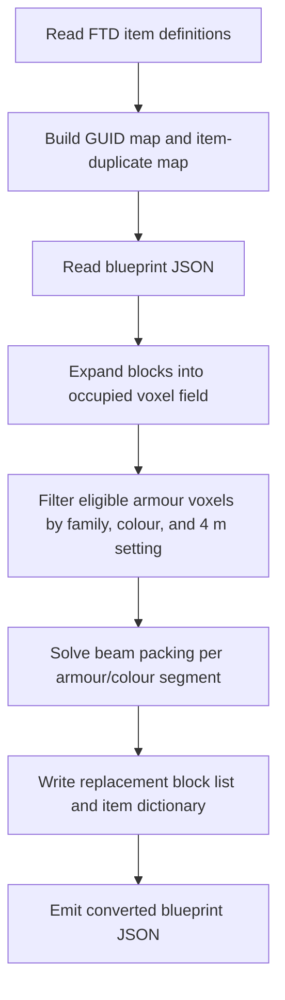

# FtD Beamification technical reference

EndlessShapes Unlimited bundles the external
[`DeltaEpsilon7787/FtD_Beamification`](https://github.com/DeltaEpsilon7787/FtD_Beamification)
tool by **DeltaEpsilon / Delta Epsilon / DeltaEpsilon7787** as optional
blueprint tooling.

Imported upstream commit: `a0aaa63010c460563909cc8eb73f2c0aac2bf5ea`.

Beamification is not a Harmony patch and is not loaded by FTD at runtime. It is
a Python script that reads a blueprint JSON file, solves an armour-block packing
problem, and writes a new blueprint. ESU packages it under
`Tools/Beamification` with the original MIT license retained.

## Purpose

FTD armour often has better effective durability when contiguous 1 m armour
blocks are represented as 2 m, 3 m, or 4 m beam variants. The tool attempts to
replace eligible armour voxels with longer beam blocks while preserving:

- occupied voxel coverage;
- armour material family;
- colour index;
- blueprint coordinates;
- simple beam orientation.

The result is a new blueprint file. The source blueprint is not modified in
place.

## High-level pipeline



## FTD definition loading

`src/blueprint.py` scans the FTD installation's
`From_The_Depths_Data/StreamingAssets` tree for:

- `.item` definitions;
- `.itemduplicateandmodify` definitions.

It builds a GUID-to-definition map and applies default fields for older or
partial definitions. Duplicate-and-modify items are expanded into concrete item
definitions by copying the referenced base item and applying cost, health,
armour, weight, volume, size, drag, mesh, material, mirror, display, and class
overrides.

This matters because blueprints store compact item IDs, while the converter must
know each block's GUID, dimensions, and beam family.

## Blueprint parsing

The parser reads:

- `ItemDictionary`: blueprint-local integer IDs mapped to item GUIDs;
- `Blueprint.BlockIds`: per-block item IDs;
- `Blueprint.BLP`: local block positions;
- `Blueprint.BLR`: FTD rotation index;
- `Blueprint.BCI`: colour index;
- `Blueprint.COL`: construct palette.

For each real block, the tool computes the block's occupied cells from the item
definition's `SizeInfo.SizeNeg` and `SizeInfo.SizePos` values after applying the
FTD rotation-index basis vectors. Cells after the origin are represented as
`PhantomBlock` entries pointing back to the original block. This gives the later
solver a voxel field rather than only origin blocks.

The bundled command-line entry point currently calls `parse_blueprint(...,
with_subconstructs=False)`, so the conversion acts on the main construct only.
The parser contains subconstruct traversal support, but it is deliberately not
used by the shipped entry point.

## Armour segmentation field

`src/s_field.py` defines armour block families as explicit GUID groups. Each
family contains the 1 m, 2 m, 3 m, and 4 m variants for one material family.

The converter builds a 3D integer field:

- `0` means no eligible armour voxel;
- non-zero values encode armour family and colour.

The encoded value is:

```text
32 * armour_family_index + colour_index + 1
```

That segmentation prevents the solver from merging different materials or
different paint colours into one beam. Optional filters can exclude existing
4 m beams or skip selected colour indexes.

## Solver model

`src/beamification.py` solves each armour/colour segment independently.

For each eligible voxel, ten candidate configurations are considered:

| Candidate | Meaning |
| --- | --- |
| 0 | 1 m block |
| 1-3 | 2 m, 3 m, 4 m beam in +X |
| 4-6 | 2 m, 3 m, 4 m beam in +Y |
| 7-9 | 2 m, 3 m, 4 m beam in +Z |

The solver builds one binary decision variable per candidate. Candidate bounds
disable beams that do not fit entirely inside the same armour/colour segment.

The coverage constraint is exact: each occupied voxel must be covered by exactly
one chosen candidate. In SciPy terms, this is a mixed-integer linear program with:

- binary/integer decision variables;
- lower and upper coverage constraints both set to `1`;
- candidate bounds set to `0` or `1` depending on whether a beam can fit.

The objective strongly penalizes single blocks and rewards longer beams. The
base coefficients prefer longer beams, and the selected `grain` changes the
relative desirability of X, Y, and Z beams. The last axis in the grain string is
treated as most important.

## Bias modes

The solver supports three tie-breaking modes:

- `random`: no coordinate-based ordering bias;
- `sided`: introduces a small coordinate bias so beams are placed more
  consistently from one side;
- `alternate`: alternates that bias by neighbouring coordinates, reducing the
  one-sided weakness that `sided` can create.

These biases are tiny compared with the main beam-length coefficients. Their
role is to choose between otherwise equivalent beam layouts.

## Large regions

Large armour segments are split before solving. If a segment exceeds the blob
threshold, the tool clusters its coordinates with SciPy `kmeans2`. This avoids
trying to solve an enormous MILP in one pass.

If a solve fails, the tool halves the current zone size and retries. Successful
4 m beams are removed from the active field and accumulated before the final
pass. The final result reassigns contiguous chosen beam groups with new integer
IDs.

## Blueprint emission

`src/make_result.py` converts the solved field back into blueprint arrays:

1. It finds each non-zero solved beam group.
2. It determines the group length and axis.
3. It finds the original block at the group's origin.
4. It preserves the original material family and colour.
5. It chooses the correct 1 m, 2 m, 3 m, or 4 m GUID from that family.
6. It appends new `BLP`, `BLR`, `BCI`, and `BlockIds` entries.
7. It adds any missing GUIDs to `ItemDictionary`.

Original blocks covered by the solved field are not deleted from the JSON arrays.
Instead, their positions are shifted far upward, outside the craft, before the
new beam blocks are appended. This matches the upstream tool's output strategy
and keeps array lengths simple, but it means the output should be inspected in
FTD and saved again under a new name after conversion.

## ESU local modification

The upstream CLI assigned `debeamify = args.procedure == "beamify"`, which
inverted the command-line behaviour. ESU's bundled copy changes that line to:

```text
debeamify = args.procedure == "debeamify"
```

No runtime FTD code depends on this tool. The local modification only affects
the bundled Python CLI.

## Operational constraints

- Python dependencies are not embedded into `EndlessShapesUnlimited.dll`.
- The packaged tool requires installing `requirements.txt`.
- The command-line import excludes subconstructs by default.
- The converter does not understand ESU decoration serializer extensions; it
  operates on normal FTD blueprint block arrays.
- Always write to a new blueprint path and keep the original craft as backup.

## Verification status

ESU verifies that the Beamification bundle is present in the deterministic
package, that DeltaEpsilon / Delta Epsilon / DeltaEpsilon7787 attribution and
the retained MIT notice are present, and that the documented local CLI fix
remains present. In-game acceptance still requires manually beamifying a
disposable blueprint, loading it in FTD, saving it under a new name, and checking
that ESU serializer HUD/load-save behaviour remains normal.
