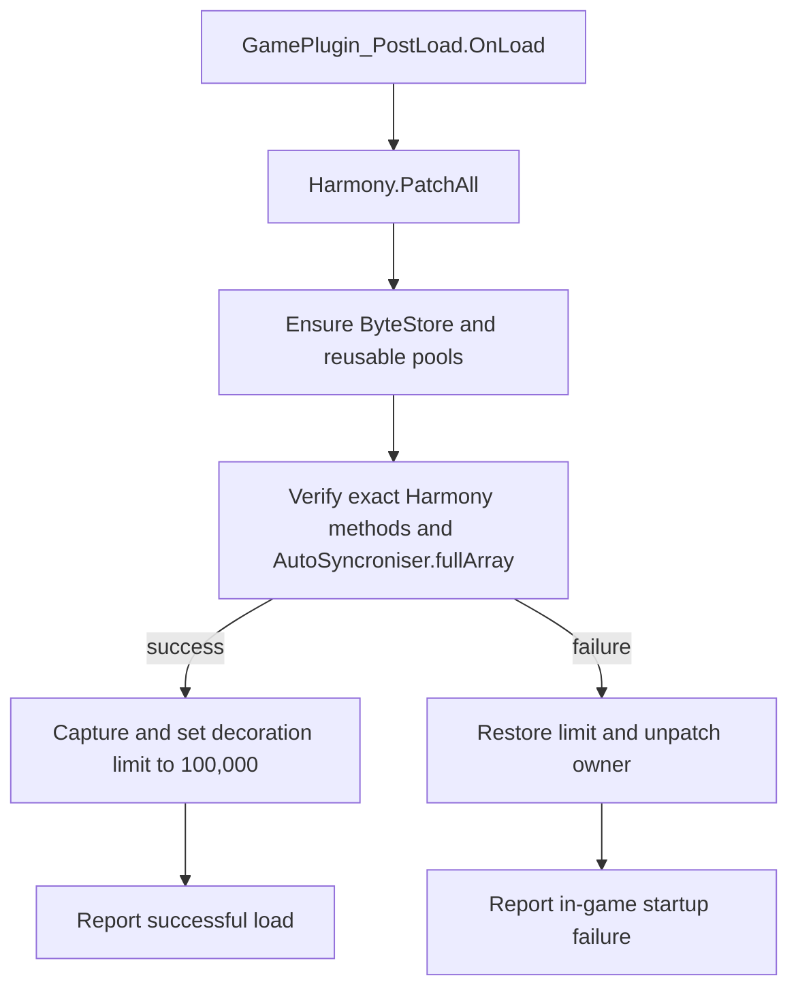

# DecoLimitLifter technical reference

This document describes the hardened DecoLimitLifter subsystem embedded in
EndlessShapes Unlimited 1.0.0. The namespace remains `DecoLimitLifter`, but the
runtime assembly and Harmony owner belong to the combined mod.

## Purpose

From The Depths normally limits a construct decoration manager to 5,000 entries.
That limit also keeps several fixed serializer arrays below their historical
boundaries. Raising only the decoration count would allow larger constructs to
overrun header, sorted-data, output, copy, and multiplayer buffers.

The subsystem therefore does two related jobs:

1. raises `AllConstructDecorations._limitPerPacketManager` to at least 100,000;
   and
2. replaces the central `SuperSaver`/`SuperLoader` container path with a
   backward-compatible extended format and bounded growable buffers.

The serializer patches are global. They protect and extend all data using these
FTD types, not only decorations.

## Startup and all-or-nothing patching

The combined `Plugin` is the only runtime entry point. It is a
`GamePlugin_PostLoad` with Harmony owner `alb.endlessshapesunlimited`.



Required verification covers:

- `SuperSaver.Serialise`;
- `SuperSaver.ConvertToReader`;
- `SuperSaver.WriteHeader`;
- the `SuperSaver` constructor;
- the exact `SuperSaverBuffersPatch.ConstructorPrefix` and
  `ByteStorePatch.AfterSuperSaverConstructor` methods;
- every matching `SuperLoader.Deserialise(byte[], ref uint, byte)` overload;
- the concrete `IVariableWriteHelp.ByIdHelpWrite(uint, uint)` implementation; and
- the EndlessShapes `GeneralTab.Mesh` patch target; and
- private static `AutoSyncroniser.fullArray` with type `byte[]`.

The decoration cap is assigned only after these checks pass and its preceding
value is captured. If a later startup step fails, rollback restores that value
and independently removes every Harmony patch with this owner. Buffer arrays that
were safely enlarged during startup are not shrunk. Success logging occurs after
commit and cannot turn a completed startup into a failed one.

`AfterAllPluginsLoaded` returns `true`; the plugin has no persistent plugin-level
state to write in `OnSave`.

## Patch inventory

| Patch or action | Target | Behavior |
| --- | --- | --- |
| `SuperSaver_Serialise_Patch` | `SuperSaver.Serialise` | Prefix calls the extended writer and skips the original |
| `SuperLoader_Deserialise_All_Patch` | Matching `SuperLoader.Deserialise` overloads | Prefix calls the extended reader, assigns the return value, and skips the original |
| `SuperSaver_ConvertToReader_BufferPatch` | `SuperSaver.ConvertToReader` | Replaces the fixed temporary buffer with an exact format-aware conversion |
| `SuperSaver_WriteHeader_Guard` | `SuperSaver.WriteHeader` | Ensures seven bytes of header capacity before the game writes |
| `SuperSaver_ByIdHelpWrite_Guard` | Concrete variable-write helper | Ensures record capacity before the game writes sorted data |
| `SuperSaverBuffersPatch` | `SuperSaver` constructor prefix plus explicit boot call | Idempotently ensures reusable header/data pool capacities |
| `ByteStorePatch` | `SuperSaver` constructor postfix plus explicit boot call | Keeps global output scratch storage at least 20 MB |
| `DecoLimitsPatch.ApplyLimit` | Direct static assignment | Raises the per-manager decoration cap without patching hot decoration methods |

The capacity guards let FTD keep its native header and variable-record writers.
Only the outer container layout and loader state reconstruction are replaced.

## FTD serialization model

`SuperSaver` builds two logical regions before emitting an outer container.

### Header table

Every header is seven bytes:

```text
[header ID: 3 bytes][SortedStart: 4 bytes]
```

`SortedStart` points into `DataSorted`. FTD uses its legacy byte conversion for
these fields. `SuperSaver.WriteHeader` records the current sorted-data cursor.
`SuperLoader.FindHeader` later uses adjacent offsets to select a segment.

### Sorted variable data

Each variable record is:

```text
[variable ID: 2 bytes][payload length: 1 byte][payload: 0..255 bytes]
```

A decoration manager writes manager metadata, package identities, data-package
headers, and the changed variables for every decoration. Decoration count
therefore increases both header count and sorted-data length. Header count is
approximately decoration count plus manager/package overhead, but exact sorted
data depends on which decoration properties are present.

### Vanilla working arrays

| Buffer | Vanilla capacity | Role |
| --- | ---: | --- |
| `SuperSaverReusableByteArray.Header` | 70,000 bytes | Shared seven-byte header records |
| `SuperSaverReusableByteArray.DataSorted` | 2,000,000 bytes | Shared variable records |
| `ByteStore.MegaBytes` | 10,000,000 bytes | Global blueprint/module output scratch array |
| `SuperSaver.ConvertToReader` local buffer | 10,000,000 bytes | Saver-to-loader copy conversion |
| `AutoSyncroniser.fullArray` | 10,000,000 bytes | Multiplayer synchronization output |

Default savers and loaders normally reference the reusable static header/data
arrays. This sharing is why a grown active array may also need to replace the
static pool reference.

## Exact layout selection

`SuperSerialisationLayout.Create` is the single source of truth used by normal
serialization and `ConvertToReader`. It validates object-ID width, calculates
header bytes as `HeaderCount * 7`, enforces configured ceilings, selects legacy or
sentinel format, and computes the exact metadata and total output size.

Object IDs may use one through eight bytes. If fewer than eight are requested,
the value must fit that unsigned width; otherwise serialization throws instead of
silently truncating the ID.

## Legacy container format

While both original length schemes can represent the payload, output remains in
FTD's established structure:

```text
[object ID: caller-selected width]
[header byte length: UInt16]
[reserved: UInt16 = 0]
[data length: 1..100 UInt16 pieces]
[header bytes]
[sorted data bytes]
```

Each data-length piece is at most 65,535. A piece smaller than 65,535 terminates
the length sequence. Zero data therefore writes one zero piece. An exact positive
multiple below the 100-piece ceiling needs an additional zero terminator. Exactly
100 full pieces use all slots and need no terminator.

Legacy boundaries are:

| Quantity | Maximum legacy value | Reason |
| --- | ---: | --- |
| Header records | 9,362 | `9,362 * 7 = 65,534`; the next valid length is above UInt16 |
| Sorted data | 6,553,500 bytes | `100 * 65,535` |

For payloads inside both boundaries, verification compares the patched output to
the unpatched FTD serializer byte for byte.

## Sentinel container format

The first value above either legacy boundary uses:

```text
[object ID: caller-selected width]
[0xFFFF sentinel: UInt16]
[header byte length: UInt32]
[sorted data byte length: UInt32]
[header bytes]
[sorted data bytes]
```

The sentinel metadata after the object ID is always ten bytes. It cannot collide
with a valid saver-produced legacy header length because valid header lengths are
multiples of seven and 65,535 is not.

Sentinel data requires this mod's loader. Vanilla FTD and the standalone old mods
cannot interpret it correctly.

## Save path

`ExtendedSuperSaver.Serialise` performs the following ordered operations:

1. Validate `self` and the object-ID width/value.
2. Create the exact layout from `HeaderCount` and `_datasWrittenSorted`.
3. Confirm the declared header and data lengths fit the active source arrays.
4. Ensure the destination has room for `prefix + exact payload`.
5. Write the caller-width object ID.
6. Write legacy or sentinel metadata.
7. Copy the used header prefix with `Buffer.BlockCopy`.
8. Copy the used sorted-data prefix.
9. Assert that the final cursor equals the previously calculated end cursor.

The final cursor assertion makes a saver/layout disagreement fail immediately
instead of shifting every following object in a shared stream.

### Destination replacement policy

The serializer receives its destination array by value, so it can only replace a
too-small array safely when the array is a known shared FTD buffer. The supported
owners are:

- `ByteStore.MegaBytes`; and
- private static `AutoSyncroniser.fullArray`.

When either is grown, the written prefix is copied and the owning static field is
updated. An unknown destination that is too small throws an actionable
`IndexOutOfRangeException`; the mod does not guess how an arbitrary caller stores
its replacement array.

`AutoSyncroniser.fullArray` is located once through Harmony reflection and
verified during startup. A missing or differently typed field fails the startup
transaction, because silently losing only the multiplayer growth path would be a
partial installation.

## Load path and corruption checks

`ExtendedSuperLoader.Deserialise` parses into local variables before committing
loader state:

1. Validate arguments and object-ID width.
2. Require and read the complete object ID.
3. Require and read the two-byte container marker.
4. Read either the two UInt32 sentinel lengths or the legacy reserved field and
   length-piece sequence.
5. Validate configured length ceilings and seven-byte header divisibility.
6. Require the complete declared header plus data payload.
7. Validate every header's `SortedStart` before allocation or state mutation.
8. Reuse or grow loader buffers and copy the complete payload. Zero-length
   regions still receive non-null empty buffers.
9. Commit ID, arrays, header count, total length, data cursor, and initial reader
   segment length.
10. Advance the caller's cursor only after successful reconstruction.

The header validator requires offsets to be monotonic and no greater than the
declared data length. It does not attempt to semantically validate header IDs or
every nested variable record; those remain FTD's responsibility when fields are
read.

The legacy reserved UInt16 is consumed but not required to be zero. A legacy data
length must terminate with a short piece or consist of exactly 100 full pieces.

Malformed input throws `FormatException` for cases including:

- truncated object ID, metadata, length pieces, or payload;
- header length not divisible by seven;
- header or data declaration above its configured ceiling;
- legacy length beyond the 100-piece maximum; and
- a header segment starting beyond data or before its predecessor.

Because state and the external cursor are committed at the end, these failures do
not leave a partially initialized loader or silently consume the next serialized
object.

### Private loader state bridge

FTD does not expose setters for all state required by a replacement loader.
`Priv` caches and requires these exact members:

- `SuperBase.HeaderCount`;
- `SuperLoader._readerLengthOfSortedSegment`;
- `SuperLoader._totalDataLengthSorted`; and
- `SuperLoader._datasWrittenSorted`.

A missing member throws during type initialization or first use. This is an
intentional fail-fast dependency on FTD internals rather than a best-effort load
with inconsistent state.

## Buffer growth

`BufferGrowth.GrowPreserving` checks the requested size and preserved-prefix
length, then either returns the existing array or allocates a larger one and
copies only the known-written prefix.

Normal runtime growth rounds up to a power of two without exceeding the relevant
hard maximum. Boot-time baseline allocations use exact sizes.

### Header guard

Before each `WriteHeader`, the prefix calculates:

```text
used = HeaderCount * 7
required = used + 7
```

It grows `SuperSaver.Header`, preserves `used` bytes, and promotes the result to
`SuperSaverReusableByteArray.Header` when the saver held the shared pool.

### Sorted-data guard

Before the concrete `ByIdHelpWrite`, the prefix reserves:

```text
required = _datasWrittenSorted + 3 + min(255, dataSize)
```

The three bytes are the variable ID and one-byte length. It preserves the already
written sorted-data prefix and likewise promotes a grown shared pool.

### Loader growth

The loader reuses an existing array when it fits. Otherwise it chooses a bounded
power-of-two capacity. If the replaced loader array was the reusable static pool,
the grown array becomes the new pool.

### Copy conversion

The replacement `SuperSaver.ConvertToReader` asks the same layout calculator for
the exact output size, with a 64 KiB minimum. It serializes object ID zero into
that buffer, deserializes it into a new `SuperLoader`, verifies the ID, and returns
the loader. This covers sentinel metadata and the legacy zero terminator at exact
65,535-byte boundaries.

## Configured limits

| Setting | Value | Effect |
| --- | ---: | --- |
| Decoration limit floor | 100,000 | Applied only when FTD's current per-manager value is lower |
| Header working data | 4 MiB | Maximum header table; up to 599,186 complete records |
| Sorted variable data | 64 MiB | Maximum `DataSorted` payload |
| Initial save output | 20,000,000 bytes | Startup baseline for `ByteStore.MegaBytes` |
| Save/sync destination | 256 MiB | Hard maximum for known output buffers |

`SaveBufferBytes` is mutable in code but has no user-facing configuration. It can
raise the boot allocation, never the 256 MiB hard ceiling.

These are independent ceilings. A construct can hit sorted-data or destination
capacity before reaching 100,000 decorations, depending on how much variable data
each decoration stores. Conversely, the decoration cap normally prevents the
header limit from being the first constraint.

Limit failures are explicit exceptions. The mod does not continue with a
truncated save or silently discard decorations.

## Compatibility behavior

| Situation | Result |
| --- | --- |
| Payload fits both legacy boundaries | Byte-compatible legacy container |
| Header count is 9,363 or more | Sentinel container |
| Sorted data is 6,553,501 bytes or more | Sentinel container |
| Sentinel file loaded with this version | Parsed and validated |
| Sentinel file loaded without the mod | Incompatible |
| Legacy file loaded with the mod | Parsed by the replacement loader |

Because core saver/loader methods are patched globally, sentinel containers can
appear in blueprint saves, copy conversions, general data packages, and network
synchronization. Every multiplayer peer must run the same combined mod version.

The manifest conflicts with standalone `DecoLimitLifter` and `EndlessShapes2` to
prevent duplicate Harmony owners, class registrations, component GUIDs, or
different serializer implementations.

## Failure and operational characteristics

- Startup failure removes owned Harmony patches and leaves FTD's existing
  decoration-limit field unchanged.
- Runtime buffer-limit or corruption failures propagate as exceptions so FTD does
  not accept incomplete data.
- Header/data pool growth preserves written bytes. Reusable pools stay enlarged
  for later saver/loader instances, reducing repeated allocation.
- Large operations can temporarily hold source arrays, grown arrays, the outer
  packet, and FTD object state at once. The configured ceilings limit individual
  buffers, not total process memory.
- The decoration cap is a direct static field assignment, not a Harmony patch.
  It avoids adding prefixes to hot add/remove methods.

## Version-sensitive dependencies

The following dependencies should be rechecked after every FTD update:

- the exact `SuperLoader.Deserialise` signature;
- the concrete `IVariableWriteHelp.ByIdHelpWrite` interface mapping;
- `SuperBase.HeaderCount` and the three private loader fields;
- static `AutoSyncroniser.fullArray`;
- `AllConstructDecorations._limitPerPacketManager`; and
- the semantic seven-byte header and three-byte variable-record prefixes.

Startup owner verification detects missing patch targets. It cannot prove that a
same-signature FTD method kept identical semantics, which is why boundary and
in-game save/load tests remain required for a new game version.

## Debug behavior

`DclDebug.Enabled` defaults to `false`. The optional verbose Harmony debug patches
are not part of the normal build: `Patches/DebugPatches.cs` is removed by the
project and the second debug logger is guarded by the undefined `DCL_DEBUG`
symbol. Normal releases therefore do not inspect every header read or emit
per-record debug spam.

## Verification coverage

The verification host applies serializer patch classes explicitly. The current
157-check suite retains all original 44 serializer compatibility/corruption
checks and includes startup rollback, exact constructor methods, required
`AutoSyncroniser` resolution, sequential shared-buffer growth, unknown-buffer
rejection, and zero-length loader coverage. Core serializer checks include:

- required Harmony target ownership;
- byte-for-byte legacy output;
- legacy and sentinel round trips;
- the 9,362/9,363 header boundary;
- the 100/101 data-piece boundary;
- exact 65,535-byte termination behavior;
- header/data growth with prefix preservation and reusable-pool promotion;
- exact `ConvertToReader` sizing;
- `ByteStore` and `AutoSyncroniser` growth;
- oversized and truncated packets;
- invalid header structure; and
- object IDs that do not fit their selected width.

Automated tests do not replace decoration-heavy in-game save/load and multiplayer
tests. Those exercise Unity/FTD ownership, real package graphs, and network paths
that the isolated host cannot reproduce.

## Source map

Paths are relative to the runtime package directory `EndlessShapesUnlimited/`.

| Area | Source |
| --- | --- |
| Runtime entry and patch verification | `Source/Plugin.cs` |
| Startup rollback transaction | `Source/StartupTransaction.cs` |
| Constants and ceilings | `Source/Patches/DecoLimits.cs` |
| Decoration cap assignment | `Source/Patches/DecoLimitsPatch.cs` |
| Exact format/layout calculation | `Source/ExtendedSerialization/SuperSerialisationLayout.cs` |
| Writer | `Source/ExtendedSerialization/ExtendedSuperSaver.cs` |
| Reader | `Source/ExtendedSerialization/ExtendedSuperLoader.cs` |
| Destination-buffer ownership | `Source/ExtendedSerialization/DestinationBuffer.cs` |
| Private loader bridge | `Source/ExtendedSerialization/Priv.cs` |
| Header/data guards | `Source/Patches/SuperSaverCapacityGuards.cs` |
| Shared pool initialization | `Source/Patches/SuperSaverBuffersPatch.cs` |
| Global output initialization | `Source/Patches/ByteStorePatch.cs` |
| Growth algorithm | `Source/Patches/BufferGrowth.cs` |
| Saver and loader Harmony prefixes | `Source/Patches/SuperSaverPatch.cs`, `SuperLoaderPatch.cs` |
| Saver-to-loader conversion | `Source/Patches/SuperSaver_ConvertToReader_BufferPatch.cs` |
