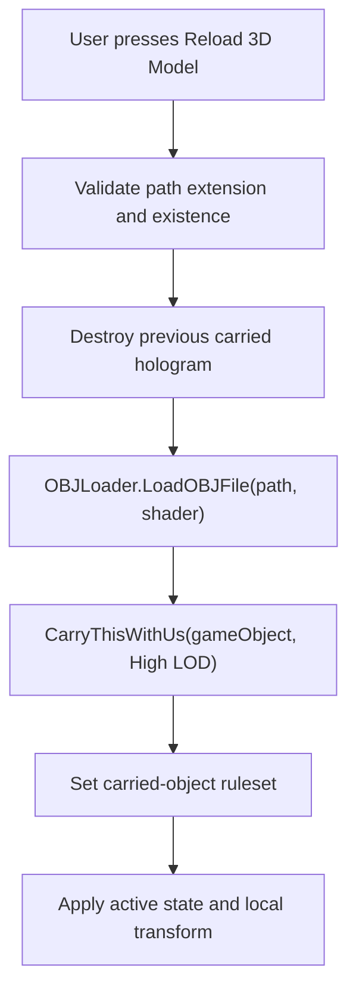
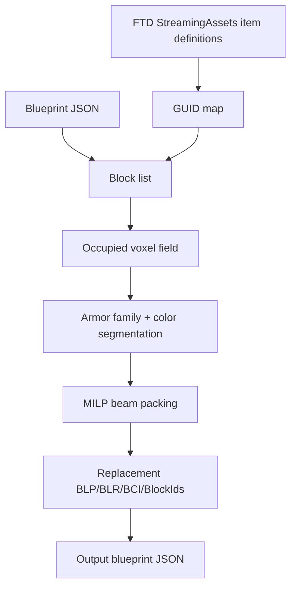

# External FTD mod research: BuildingTools and Beamification

Research date: 2026-06-28

Sources inspected:

- BuildingTools repository: https://github.com/wengh/BuildingTools
- BuildingTools commit: `b904ea6006eac2d6f03a538fa1ad6817fad572d3`
- FtD_Beamification repository: https://github.com/DeltaEpsilon7787/FtD_Beamification
- FtD_Beamification commit: `a0aaa63010c460563909cc8eb73f2c0aac2bf5ea`

Both projects are MIT-licensed. BuildingTools is credited to Wengh / Weng Haoyu,
and FtD_Beamification is credited to DeltaEpsilon / Delta Epsilon /
DeltaEpsilon7787.

## Executive summary

BuildingTools is an in-game FTD `GamePlugin` that registers normal FTD profile
modules, key bindings, option screens, custom item definitions, and runtime
Unity objects. Its 3D Hologram Projector is a custom block whose class name is
`Holo3D`. The block stores projector settings through FTD's `IBlockWithText`
serialization path, loads local `.obj` files at runtime, builds a Unity
`GameObject` mesh hierarchy, and carries that object with the block through
FTD's `CarriedObjectReference` system.

FtD_Beamification is different: it is not an in-game mod. It is an offline
Python blueprint transformer. It reads FTD item definitions and a blueprint JSON
file, expands armor blocks into an occupied voxel field, solves a mixed-integer
packing problem, and writes a new blueprint with eligible armor replaced by
longer beam variants.

For ESU, the most useful BuildingTools pattern is the Hologram Projector's
separation between:

- a tiny in-game controller block;
- persisted settings stored as text JSON;
- heavy local asset loading performed only on explicit reload or opt-in load;
- visual geometry carried by FTD rather than saved into block arrays.

The most useful Beamification lesson is its clear external-tool boundary:
expensive, destructive, or optimization-heavy blueprint transformations are
kept outside FTD runtime and operate on files, not live constructs.

## BuildingTools structure

The current source is a .NET Framework 4.6 C# mod. The project compiles to
`BuildingTools.dll` and references FTD/Unity assemblies directly from the game
install. It also embeds a Unity asset bundle resource named `buildingtools`.

Relevant source files:

- `BuildingToolsPlugin.cs`: plugin entry point.
- `BtSettings.cs`, `BtKeyMap.cs`, `BtPanel.cs`: profile storage, key bindings,
  and options UI.
- `Holo3D/Holo3D.cs`: custom hologram projector block.
- `Holo3D/Holo3DUI.cs`: projector configuration UI.
- `ThirdParty/OBJImport/OBJLoader.cs`: runtime OBJ and MTL loader.
- `ThirdParty/OBJImport/TextureLoader.cs`: PNG/JPG/DDS/TGA texture loading.
- `Visualizer/ACVisualizer.cs`: armor visualizer mode.
- `Calculator/*`: calculator UI and math parser wrapper.
- `Items/3D Hologram Projector_96d6dac.item`: FTD item definition that binds
  the in-game block to `Holo3D`.

At plugin load, `BuildingToolsPlugin.OnLoad()`:

- loads the embedded Unity asset bundle from `Properties.Resources.buildingtools`;
- logs the bundle contents;
- registers calculator and armor visualizer key handlers with
  `GameEvents.UpdateEvent`;
- optionally shows a "new features" popup through a player profile module;
- adds a BuildingTools screen to `FtdOptionsMenuUi.ExtraScreens`.

The current source no longer contains the old Block Search Tool or Block
Counter implementation. The README still lists those features, but the changelog
says "Build Mode Tools" were removed in 0.10.0, and the 0.11.0 source has no
active block search/counter classes.

## BuildingTools 3D Hologram Projector

The projector is a custom FTD item in the Decorations tab. Its item JSON points
`Code.ClassName` at `Holo3D`, which means FTD instantiates the C# `Holo3D`
block class for that item.

The item definition is intentionally small and cheap:

- display name: `3D Hologram Projector`;
- description: projects a 3D object;
- weight: `0.1`;
- material cost: `100`;
- all attach directions allowed;
- displayed in the Decorations inventory tab;
- mesh/material are normal FTD references for the projector block itself.

The actual model being projected is not encoded into the item file. It is loaded
from a user-supplied local path at runtime.

### Runtime lifecycle

`Holo3D` derives from `Block` and implements `IBlockWithText`. The important
state is:

- `Path`: local `.obj` path, trimmed of quotes and spaces.
- `ShaderName`: selected shader name.
- `Enabled`: whether the carried hologram object is active.
- `displayOnStart`: whether loading should happen automatically when text state
  is restored.
- `pos`, `rot`, `scale`: local transform relative to the projector block.
- `baseScale`: fixed multiplier of `1.5`.
- `hologram`: FTD `CarriedObjectReference`.

On `BlockStart()` the block:

- calls base block initialization;
- creates an empty carried object with `CarryEmptyWithUs`;
- lazily loads shader choices from the embedded asset bundle;
- adds fallback FTD/Unity shaders;
- checks out a construct-unique ID if needed.

When the player opens the block with secondary interaction, `Holo3DUI` creates a
native FTD `ConsoleUi` window. That window contains:

- text input for the `.obj` path;
- "Reload 3D Model" button;
- `Enabled` toggle;
- `Display on start` toggle;
- shader dropdown;
- sliders for local position, rotation, and per-axis scale.

The reload path is:



`Reload()` accepts only configured extensions, currently `.obj`. It destroys the
previous carried object, loads the OBJ as a Unity `GameObject`, then passes it
to `CarryThisWithUs(..., LevelOfDetail.High)`. The carried object rules are set
to destroy when the block is removed and deactivate when the block is dead.

`SetLocalTransform()` applies:

- local position from `pos`;
- local rotation from `Quaternion.Euler(rot)`;
- local scale from `scale * baseScale`.

Errors go through `BuildingToolsPlugin.ShowError`, which logs an exception and
shows a popup.

### Persistence and multiplayer sync

The projector persists its settings as JSON through `IBlockWithText`.

`GetText()` serializes the `Holo3D` instance with Newtonsoft.Json. A custom
`VectorContractResolver` only serializes `Vector3.x`, `.y`, and `.z`, avoiding
Unity internals.

`SetText()` deserializes the saved text back into the block, syncs the text to
multiplayer-restricted block state through
`RPCRequest_SyncroniseBlock(this, GetText())`, and reloads the model only if
`displayOnStart` is enabled.

`StateChanged()` registers and unregisters the block in
`iBlocksWithText.BlocksWithText`, which is how FTD discovers blocks with text
state for save/load.

Practical implication: the blueprint stores settings, not mesh payloads. The
user must still have the local OBJ and texture files at the configured path for
the hologram to reload.

### OBJ, material, and texture loading

The OBJ loader is a third-party runtime importer. It supports:

- `v`, `vn`, `vt`, `f`, `g`, `o`, `usemtl`, and `mtllib` records;
- triangular and quad faces;
- optional material splitting;
- 16-bit or 32-bit Unity mesh indices depending on vertex count;
- no-material models by using a default material path in current source;
- multiple Unity child objects under a parent GameObject;
- mirrored local X scale on subobjects, probably to match FTD/Unity coordinate
  expectations.

Material loading parses MTL records such as:

- `newmtl`;
- `Kd`;
- `Ks`;
- `Ns`;
- `map_Kd`;
- `map_Bump`;
- `map_Ao`.

Texture lookup searches:

- the OBJ directory;
- a `%FileName%_Textures` subdirectory;
- a `textures` subdirectory.

Texture formats handled by the loader are:

- `.png`;
- `.jpg`;
- `.dds`, with manual DXT1/DXT5 handling;
- `.tga`, with 24-bit and 32-bit support.

Normal maps are converted by channel swizzling before assignment.

### Hologram shader model

Shaders are loaded from the embedded asset bundle and from FTD/Unity fallbacks.
The README describes three user-facing modes:

- Hologram/Glass;
- Transparent;
- Solid.

The C# code removes a shader named like `AddShader` from the selectable shader
list, then adds FTD block shaders and Unity Standard as fallbacks. Material setup
sets shader-specific properties such as rim power, base color alpha, emission,
main color, specular/rim color, smoothness, main texture, normal map, and
occlusion map.

### Performance and safety notes

The 0.11.0 changelog says hologram loading for large models was improved from
quadratic to linear behavior, and that models without material and meshes above
65,535 vertices were fixed. The current OBJ code reflects that:

- it uses a hash table for unique vertex/normal/UV tuples;
- it uses Unity `IndexFormat.UInt32` for large meshes.

Remaining risks:

- loading is synchronous on the game thread;
- OBJ and texture files are read directly from disk;
- large models/textures can still hitch or allocate heavily;
- local paths are stored in blueprints, which is convenient but not portable.

For ESU-style features, an explicit reload button plus an opt-in "display on
start" toggle is a good pattern for expensive asset work.

## Other current BuildingTools features

### Calculator

The calculator is a lazily-created `ConsoleUi` bound to the Insert key by
default. It wraps `Mathos.Parser.MathParser`, keeps input/output history, and
provides helper functions:

- `clear()`;
- `help()`;
- `out(index)`;
- `_` as the last output.

The UI uses a custom text input that listens for Enter, Up, Down, and Escape.

### Armor Visualizer

The armor visualizer is launched from the Home key after a confirmation popup.
It creates an `ACVisualizer` GameObject and effectively takes over the scene.

At startup it:

- saves profiles;
- selects the focused construct or build-mode construct;
- loads a compute shader from the BuildingTools asset bundle;
- creates a new camera;
- destroys other root scene GameObjects;
- locks and hides the cursor;
- adds a fly camera component.

It converts the selected construct into 3D compute buffers containing:

- block identity hash;
- armor value;
- maximum health;
- armor stacking multiplier.

`OnRenderImage()` updates camera matrices and dispatches the compute shader to a
floating-point render texture. Pressing the visualizer key again releases
buffers, unloads the shader asset, and calls `UnityInterface.RestartGame()`.

This is intentionally invasive and not suitable for normal in-game overlay code.
It works more like a dedicated analysis mode.

### New-features popup and settings

BuildingTools stores user settings in player profile modules:

- `profile.buildingtools`;
- `profile.keymappingBt`;
- `profile.receivedfeaturesBT`.

It uses FTD's options UI extension point to expose settings and key bindings.

## Beamification structure

FtD_Beamification is a Python command-line/GUI tool with these files:

- `__main__.py`: CLI and Tkinter GUI entry point.
- `src/blueprint.py`: FTD item-definition loading and blueprint parsing.
- `src/s_field.py`: armor-family filtering and voxel segmentation.
- `src/beamification.py`: mixed-integer beam packing solver.
- `src/make_result.py`: blueprint writer.

Runtime dependencies are:

- `attrs`;
- `numpy`;
- `scipy`;
- `tqdm`.

The upstream entry point supports:

- `cli --ftd <game dir> --input <blueprint> --output <blueprint> beamify`;
- `cli ... debeamify`;
- GUI mode through Tkinter dialogs.

The upstream commit inspected contains a CLI inversion bug:

```text
debeamify = args.procedure == "beamify"
```

That makes the CLI boolean opposite of the command name. ESU's bundled copy
fixes this to `args.procedure == "debeamify"`.

## Beamification data flow



### Item-definition loading

`get_guid_map()` scans the FTD `StreamingAssets` tree for:

- `.item`;
- `.itemduplicateandmodify`.

The tool expands duplicate-and-modify definitions into concrete item definitions
by copying the referenced base item and applying size, drag, cost, health,
weight, armor, mesh, material, mirror, display, and class-name overrides.

It also injects defaults for fields that may be absent from older definitions.
This makes later code simpler because every GUID entry can be queried for
`SizeInfo`, `Cost`, `ExtraSettings`, drag data, and references.

### Blueprint parsing

`parse_blueprint()` reads:

- `ItemDictionary`;
- `Blueprint.BlockIds`;
- `Blueprint.BLP`;
- `Blueprint.BLR`;
- `Blueprint.BCI`;
- `Blueprint.COL`;
- optionally `Blueprint.SCs`.

For each block, it constructs a `Block` object containing:

- item definition;
- coordinate;
- rotation index;
- color index.

The rotation index is interpreted through fixed `ROTS_X`, `ROTS_Y`, and
`ROTS_Z` lookup tables. Those basis vectors are used with item `SizeInfo` to
expand multi-cell blocks into a set of occupied cells.

Cells occupied by the same original block but not at the origin become
`PhantomBlock` instances. A phantom block proxies most properties to the parent
block while carrying a distinct coordinate.

Subconstruct traversal exists and accounts for local position and quaternion
rotation, but the upstream CLI currently calls:

```text
parse_blueprint(..., with_subconstructs=False)
```

So normal CLI conversion only touches the main construct.

### Armor segmentation field

`s_field.py` hard-codes armor block families by GUID. Each family maps related
1 m, 2 m, 3 m, and 4 m armor variants to a parent material family.

`construct_s_field()` creates a dense 3D integer array covering the occupied
coordinate bounds. Each eligible cell is encoded as:

```text
32 * armor_family_index + color_index + 1
```

That prevents the solver from merging:

- different armor materials;
- different color indexes;
- excluded existing 4 m beams;
- user-excluded colors.

Zero means empty or ineligible.

### Solver model

`beamification.py` solves one armor/color segment at a time. Each voxel has ten
candidate configurations:

| Candidate | Meaning |
| --- | --- |
| 0 | 1 m block |
| 1-3 | 2 m, 3 m, 4 m beam in +X |
| 4-6 | 2 m, 3 m, 4 m beam in +Y |
| 7-9 | 2 m, 3 m, 4 m beam in +Z |

For every candidate, the solver checks whether that beam fits fully inside the
same segment. Non-fitting candidates receive an upper bound of zero.

Coverage is expressed as a sparse linear constraint: every occupied voxel must
be covered exactly once. The SciPy call is a mixed-integer linear program using:

- `Bounds`;
- `LinearConstraint`;
- `coo_array`;
- `milp`;
- integer variables;
- `time_limit: 15`;
- `presolve: False`.

The objective coefficients penalize 1 m blocks and reward longer beams. The
`grain` string changes axis priority by scaling coefficients according to the
position of `x`, `y`, and `z` in the grain ordering.

Bias modes are small tie-breakers:

- `random`: no coordinate bias;
- `sided`: coordinate bias for more consistent direction choices;
- `alternate`: flips coordinate bias across neighboring cells to reduce
  one-sided weakness.

Large segments are handled by clustering points with SciPy `kmeans2` when the
segment exceeds the current blob threshold. If solving fails, the active zone
size is halved and the tool retries. Successful 4 m beams are extracted first,
then remaining cells are solved and merged into a final result field.

### Blueprint writing

`make_bp_from_field()` converts the solved field back into blueprint arrays.

For each solved group it:

- computes the beam length from group size;
- infers orientation from coordinate ordering;
- uses the original block at the group origin to preserve material family and
  color;
- chooses the matching GUID whose `SizeInfo.SizePos.z` matches `size - 1`;
- appends new entries to `BLP`, `BLR`, `BCI`, and `BlockIds`;
- adds missing GUIDs to `ItemDictionary`.

Original blocks covered by the result are not deleted. Their `BLP` entries are
moved upward by craft height plus 10. This avoids rebuilding every parallel
array from scratch, but it means the output blueprint contains displaced old
blocks plus new beam blocks. In practice, converted crafts should be loaded,
inspected, and saved under a new name.

## Cross-mod lessons for ESU

### Hologram-style local asset previews

BuildingTools demonstrates that an FTD block can persist only configuration
text while rendering a heavy local asset through a carried Unity object. For ESU
or decoration tooling, the same pattern is useful when preview data should not
be serialized into blueprint block arrays.

Recommended pattern:

- persist a small JSON state object through FTD's text/block serialization;
- keep external file paths explicit;
- load heavy assets only on button press or opt-in startup;
- use `CarriedObjectReference` or an equivalent runtime-only object for visuals;
- keep the saved blueprint free of generated mesh payloads.

Main caution: local file paths are not portable. Any feature using this pattern
should make missing-file behavior clear and avoid loading on startup by default.

### Native UI reuse

BuildingTools uses FTD `ConsoleUi`, `ProfileModule`, `KeyMap`, and
`FtdOptionsMenuUi.ExtraScreens` rather than a separate UI framework. That keeps
settings, keybinds, and in-game configuration consistent with FTD conventions.

This matches the direction ESU already follows for profile-backed keybinds and
native-style editor panels.

### External optimization tools

Beamification is a good boundary example for expensive transformations:

- it operates on files;
- it requires backups and explicit output paths;
- it does not patch FTD runtime;
- it can use heavy Python/SciPy dependencies without inflating the mod DLL;
- failures do not destabilize the game process.

For ESU, solver-heavy operations such as full-craft geometry conversion,
beamification, or global decoration optimization should remain external unless
there is a strong in-game workflow reason to move them inside FTD.

### Blueprint compatibility risks

Beamification works on plain blueprint JSON arrays, not ESU serializer internals.
It does not preserve or understand all possible runtime block state payloads.
It also ignores subconstructs in the shipped CLI.

If ESU exposes Beamification or similar tools, the UI should label them as
offline converters and warn that:

- the source blueprint should be backed up;
- output should be saved under a new name;
- subconstructs may not be converted;
- the resulting craft should be loaded and resaved in FTD before sharing.

### What not to copy directly

Do not copy BuildingTools' armor visualizer structure into normal ESU runtime
features. It destroys the active scene and restarts the game to exit. That is
acceptable for a dedicated visualization mode with a warning popup, but not for
routine editor or HUD behavior.

Do not copy Beamification's "move old blocks upward" output strategy into code
that claims to cleanly edit craft geometry. It is pragmatic for an offline
converter, but a live editor should update arrays/construct state directly or
make the displaced-block behavior explicit.
